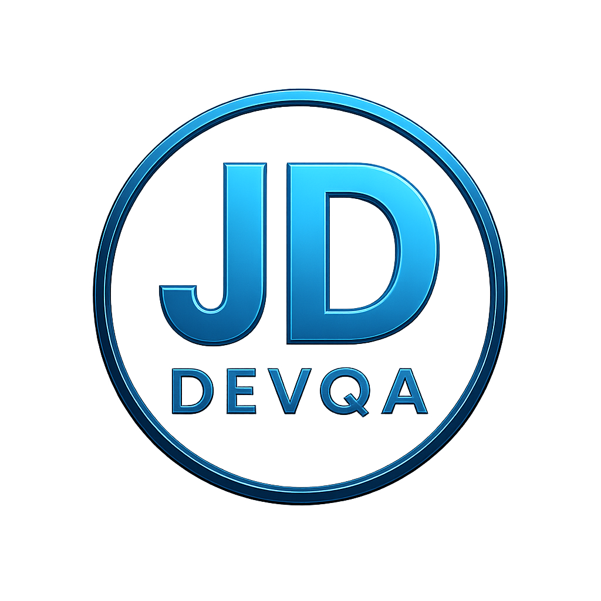

<!-- =========================
     JDDEVQA • Premium Profile
     ========================= -->

<!-- ===== Premium Header (Banner + Logo + Typing) ===== -->

  <!-- Logo -->
  

   

  <!-- Premium Headline -->
  

    

  <!-- Social + Role badges -->
  
  
  

---

## 💎 About Me
**Senior QA Leader** delivering resilient, high‑quality products through **strategic test design**, **automation excellence**, and a leadership mindset built on **clarity, collaboration, and impact**.

---

## 🧰 Automation Tools & QA Stack

  <!-- Core QA -->
  
  
  
  

   

  <!-- Test Management / Bug Tracking -->
  
  
  

   

  <!-- DevOps / CI -->
  
  
  

<!-- Java intentionally hidden (as requested) -->
<!--

-->

---

## 📌 What I Do
- ✅ Test Strategy • Test Planning • Quality Leadership  
- ✅ Manual Testing • Regression • Smoke • UAT  
- ✅ Automation (UI/API) • Framework Design • CI‑friendly suites  
- ✅ API Testing • Bug Analysis • RCA mindset  
- ✅ Process Improvement • Mentoring • Quality culture  

---

## 📊 GitHub Analytics

  
   
  
   
  

---

<!-- =========================
     Featured Work (Hidden)
     Uncomment when you want
     ========================= -->
<!--
## 🚀 Featured Work
- ⭐ **Automation Frameworks** — (add repo link)
- ⭐ **API Collections (Postman)** — (add repo link)
- ⭐ **QA Templates** (Test Plan, Test Cases, Bug Report) — (add repo link)
- ⭐ **Case Studies / RCA Notes** — (add repo link)
-->

---

## 🌐 Connect

  

  <b>✨ JDDEVQA</b> — Automating quality, one test at a time.

